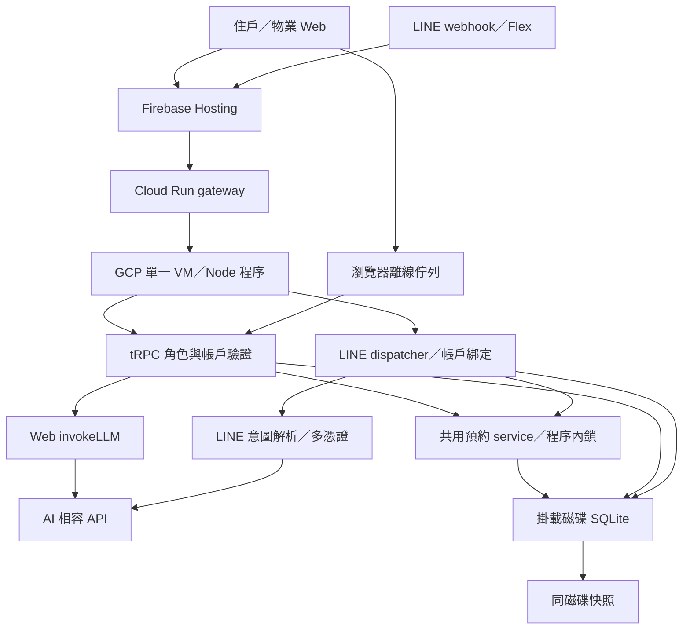

# 架構與功能稽核（2026-09-10）

結論：目前適合受控 Demo，尚不足以宣稱正式住戶服務完整。主要缺口不是畫面數量，而是跨入口共用規則、帳戶切換、AI 配置一致性與持久事件處理。此次為程式／契約稽核，不是滲透測試或全頁瀏覽器驗收；未修改線上資料或設備。

## 範圍與基準

- 檢查 tRPC 角色守衛、token context、16個領域router（另有整合index）、LINE dispatcher／紀錄／月曆、預約service與db、聊天LLM、離線同步、IoT、通知、持久启动及部署配置。
- 盤點43個app TSX頁面／layout；不是43頁逐頁點擊通過。公告／包裹／停車／財務檢查入口權限與代表流程，不表示所有repository分支均已稽核。
- 沿用同一工作階段110檔763項測試、type-check、lint、Web build通過結果；本輪新跑SQLite隔離smoke通過，涵蓋認證、診斷權限、預約建立取消、物業CRUD與聊天成功／失敗HTTP契約。
- smoke明確顯示外部AI未設定；不得當作真實Gemini、NLP、IoT驗收。本輪沒有重新查線上GCP資源；部署拓撲依firebase.gcp.json、專案記憶與先前部署驗證。
- 工作區診斷修正尚未發布；線上基準仍為calendar-20260910。使用者簡報異動保留。

## 實際架構與邊界

同一DB是紀錄來源，但AI、設備與部分寫入仍存在不同實作路徑。Cloud Run是轉接層，不代表SQLite後端已具多实例一致性。資料庫adapter存在不等於全部功能可移到Postgres：LINE、帳務、停車、公告等仍直接依賴getRawSqlite與SQLite repository。

## 優先缺口

P1＝影響核心功能或帳戶／紀錄正確性；P2＝限制正式上線、可靠性或可操作性。下列「程式確認」不等於線上事故已發生。

| ID／級別 | 發現與證據 | 驗證程度／影響 | 修復驗收條件 |
|---|---|---|---|
| A01 P1 | Web聊天走`routers/chat.ts`→`services/chatService.ts`→`_core/llm.ts invokeLLM`；送出整串ENV.openaiApiKey，預設gpt-4o-mini，chatService未指定model | 本機攔截fetch重現`combinedCredentials=true, model=gpt-4o-mini`；與LINE Gemini配置不一致，診斷修好後Web推論仍可能失敗 | 共用模型／憑證解析；主用成功、主用拒絕→備援、皆失敗回真實錯誤；不得只修health |
| A02 P1 | `bookings.create`日期與時間僅z.string；`bookingService.createCheckedBooking`只查設施啟用與容量；`bookingCapacity.toMinutes`未限制HH/MM範圍 | 本機純函式接受25:00–26:00與10:99–12:00；營業時間、過去日期、時長／對齊缺少共用寫入檢查。未向線上送非法預約 | 住戶API、LINE、語音均在寫入前驗證真實台北日期、合法時間、營業時段、時長與政策；直接API繞過UI仍拒絕 |
| A03 P1 | `offline.ts`使用全域`@offline_sync_queue`且operation無owner；`_layout.tsx`重送使用trpcProxy；`trpc.ts`每次取當前token；`use-auth.ts`logout未處理佇列 | 程式追蹤確認；A離線建立工單／聊天→切B→同步，存在歸入B帳戶風險。取消別人預約仍有伺服器所有權防護，不能混稱所有操作都能越權。尚未跨帳戶瀏覽器重現 | 佇列以不可混淆帳戶識別隔離；切換／登出暫停同步，舊操作只能由原帳戶送出；涵蓋重新整理及同步中切換 |
| A04 P1（正式使用前） | `_core/token-auth.ts`接受環境共享角色token，無production profile限制；`0008_web_tokens.sql`個人token無期限欄位；`auth.logout`只清cookie | 程式確認。Demo角色切換為既有功能，但共享管理權限與長效個人bearer不應直接成為正式認證；登出本機不等於撤銷外流token | 正式環境停用共享角色token；個人token具輪替／撤銷／期限策略；明確區分本機登出與所有裝置撤銷 |
| A05 P2 | `workOrders.delete`直接hard delete，`db.deleteWorkOrder`未處理`line_record_links`；關聯表只有文字ref，沒有實體外鍵 | 程式確認。已關聯WO/V刪除後留下懸空關聯，歷史被刪；SQLite foreign_key_check無法檢查這種文字ref | 決定歷史保留政策；有關聯拒刪或軟刪，查詢顯示封存；不可默默失去關聯證據 |
| A06 P2 | `iot.updateDevice`只呼叫`db.updateDeviceStatus`；`system.runJob`延時更新DB並宣稱完成 | 程式確認。與硬體gateway為不同路徑；此成功只代表Demo資料改變，沒有設備ACK證據 | 明確標示模擬；實體路徑等待回報，區分已送出／設備確認／失敗；不得將DB更新當作硬體已執行 |
| A07 P2 | `system.runJob`使用未await的IIFE與setTimeout，無持久worker／重啟恢復機制 | 程式確認。VM重啟可能留下running；失敗分支只更新progress文字，需再核對終態 | 任務持久化、重啟恢復或標記中斷；重試不重複控制 |
| A08 P2 | `workOrders.update`、`bookings.updateStatus`與LINE完成通知best-effort捕捉失敗，不具持久outbox | 程式確認，之前故障測試保證不誤報寫入失敗，但通知仍可永久遺失；重送同狀態亦可能再推播 | 交易內保存通知事件、可重試／去重、可查失敗；不要把資料提交成功與通知成功混為一談 |
| A09 P2 | `createCheckedBooking`鎖為程序內；`createBooking`無client request id／唯一冪等鍵 | 程式確認。單程序容量鎖已改善超額；回覆遺失後重送仍可能重複建立。多Node程序不共享鎖 | 建立請求有冪等鍵；同key重送同結果；擴展到多程序前加入DB併發保護與多程序測試 |
| A10 P2 | `access.logEntry`為protectedProcedure，result與entryPoint由登入者提供 | 程式確認。若當可信門禁稽核，住戶可提交自述success；未在線上嘗試。可能是Demo輸入，需定義用途 | 裝置簽章／受信任gateway上報；住戶回報與設備事實分欄，禁止混用 |
| A11 P2 | `start-persistent.ts`掛載與快照防護存在；scheduler備份到同一資料磁碟 | 程式／先前部署記憶確認。磁碟故障仍可能同時失去DB及自動備份；本輪未驗證異地服務現況 | 自動異地备份、保留策略、離線還原演練、RPO/RTO與失敗告警 |
| A12 P2 | 診斷原NORMAL為硬體警報；AI health原合併key；systemDiagnostics把未啟用NLP計入degraded | 前兩項本機已修未發布。獨立NLP未啟用是配置事實，不等同LINE Gemini失效；整體是否降級需明確必需／選配定義 | 分服務顯示配置／探測／推論；必需服務與選配功能分開；既有安全錯誤不能被綠燈掩蓋 |
| A13 P2 | 常用部署腳本留在忽略的`_local/gcp`，正式frontend環境與本機.env.local不同；歷史文件仍列Render/Vercel | 程式與本輪檔案檢查。新接手者依舊文件或直接發布dist可能送錯API／token；尚無一次可重現的完整正式發布命令 | 將去憑證的發布／回滾／驗證腳本納入repo；明確Firebase+GCP單一入口；正式建置檢查API origin及憑證一致性 |

## 功能覆蓋與尚未證明的部分

| 功能 | 已有依據 | 仍需驗收 |
|---|---|---|
| 認證／角色 | resident/staff/admin procedure分工；個人token查users；公告依角色篩選 | A03/A04跨帳戶、正式認證、撤銷 |
| 預約／取消 | 共用容量鎖、本人取消、完成不可取消；隔離smoke通過 | A02非法時間／過去日期；A09重送／多程序 |
| LINE服務與行事曆 | 固定postback、本人月份查詢、分頁、Web雙入口；前輪官方格式與webhook通過 | 真實手機／桌面點擊、長資料、斷線重送 |
| 工單／訪客／停車關聯 | BK/V/P/WO查詢與同住戶關聯檢查 | A05刪除後歷史、A08通知交付 |
| Web聊天 | 成功才存assistant訊息、失敗不偽造；HTTP契約smoke通過 | A01與真實供應商整合；長輸入／併發成本 |
| 公告／包裹／停車／帳单 | 代表API有角色分層、住戶查本人、管理操作 | 全頁CRUD、錯誤重試、已付款／已領取／已結束資料保留政策 |
| 財務／錢包 | 帳單記帳能力存在 | 付款供應商、對帳、重複回呼；錢包加值仍非已完成支付 |
| IoT／自動情境 | 設備所有權檢查、Demo狀態更新 | A06/A07實體執行與任務復原 |
| NLP／語音／RAG | Node測試與語音契約；獨立NLP選配 | Python模型與服務未驗收、實機麥克風；RAG尚未實作 |
| 維運 | 掛載防護、Online Backup、先前部署完整性驗證 | A11異地還原、A13可重現發布、遠端CI額度問題 |

## 已排除的過時發現

- `activity.tsx`工單卡已為View，舊UX-12「無onPress卻可按」不再成立。
- LINE查單循環、轉派空按鈕、取消指引及雙行事曆已於前輪發布，不列為本輪新缺陷。
- 權限存在不表示端到端隔離已完整；同樣不能因Demo token存在就宣稱已發生資料洩漏。

## 建議修復順序

1. A01共用AI設定與A02共用預約寫入規則：直接影響主要住戶功能。
2. A03帳戶隔離與A09冪等：避免離線／重送造成錯帳與重複紀錄。
3. A05歷史保留、A08通知outbox、A11異地備份。
4. A04正式認證、A06/A07設備任務；A10門禁可信來源。正式化之前必須先完成，不能用Demo驗收替代。
5. A12診斷發布、A13部署腳本與文件整理；配合逐頁／跨角色瀏覽器驗收。

以上為原始稽核基準；接續修復與發布結果如下。

## 13項修復結果（2026-09-10）

| ID | 狀態 | 實作與驗證 |
|---|---|---|
| A01 | 已修復／發布 | Web依OPENAI_MODEL使用Gemini，多key分開、總逾時與body期限；實際gemini-3.5-flash-lite推論成功 |
| A02 | 已修復／發布 | SQLite與共用service拒絕非法／過去日期、時間、營業範圍及slot不對齊；跨時段容量按同時使用高峰計算 |
| A03 | 已修復／發布 | 離線owner雜湊隔離、固定送出憑證、非同步換帳號競態與快取防護；舊無owner操作保留但不展示／重送 |
| A04 | 已修復／發布（Demo） | 個人token30天期限、撤銷、過期重新簽發保留原帳戶；APP_PROFILE=production拒絕共享角色token。現行仍Demo，非正式身分驗收 |
| A05 | 已修復／發布 | SQLite交易內拒絕刪除已關聯WO/V，保留查詢證據 |
| A06 | 已防止誤報／發布 | IoT明示simulation、acknowledged=false；無adapter時實體模式拒絕。真實設備ACK整合尚未完成 |
| A07 | 已修復／發布（模擬任務） | 等待執行結果、失敗終態、啟動標記中斷；不自動重播控制，不宣稱多worker實體任務調度 |
| A08 | 已修復／發布 | 交易outbox、持久重試、續租、逐收件人紀錄、同紀錄通知排序、後台失敗統計；移除重複best-effort推送 |
| A09 | 已修復／發布（SQLite） | Web／離線／LINE／語音requestId，SQLite IMMEDIATE交易與trigger；多Node程序及回覆遺失重送測試通過 |
| A10 | 已隔離可信性／發布 | 舊門禁來源unverified、新自述demo、強制本人；UI不宣稱實體開門成功。可信硬體上報入口尚未完成 |
| A11 | 部分完成，保持開啟 | 備份／禁止覆寫／GCS重新下載／新檔還原腳本與5項測試完成；未建立私人bucket、啟用排程、實際GCS往返或告警。見OFFSITE_BACKUP_RUNBOOK.md |
| A12 | 已修復／發布 | 整體狀態取真實診斷，選配NLP未啟用不誤判核心失效，顯示錯誤／備援／檢查時間；線上瀏覽器確認 |
| A13 | 已修復／發布 | 納入明確env建置、manifest、migration、快照、原子切換及回退腳本；本次實際使用並驗證。見CURRENT_RELEASE_RUNBOOK.md |

驗證：125檔829項測試、type-check、lint、正式env清快取Web build、SQLite隔離smoke通過。部署前以完整線上快照副本實際套用0018／0019／0020，原27張資料表筆數與完整性／外鍵均通過；部署後快照再次確認27張原表筆數相同、integrity=ok、foreign_key_check=0，未重跑init。

Firebase最新bundle為entry-b4b3c098d5b7ead8417ccdc7edcdfbb5.js；VM release為audit-20260910，Cloud Run revision為mai-touch-gateway-00002-nbv。健康檢查db=ok／line=ready，LINE官方webhook/test success=true／200。LINE retry header與409確認以mock驗證，未代發真實用戶訊息。瀏覽器實測管理診斷、住戶角色切換與設定入口，不等於全頁／手機LINE／麥克風驗收。

通知交付是持久重試，並非永遠恰好一次：LINE retry key有供應商有效期限，接收API成功不保證收件人讀取。成功收件人已持久記錄；未知結果跨長時間重試仍須人工查核。參考[LINE重試規範](https://developers.line.biz/en/docs/messaging-api/retrying-api-request/)。非SQLite分支未取得同等多程序與outbox保證。
